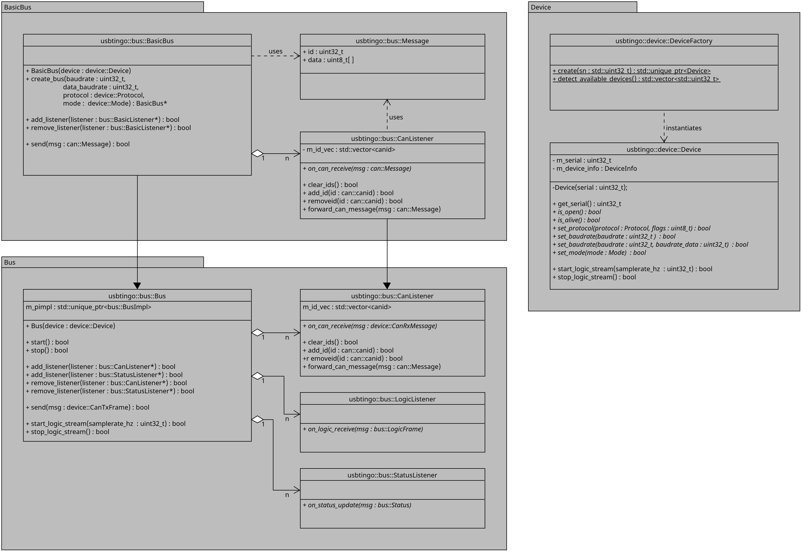

# Libusbtingo
C++ API for the USBtingo - USB to CAN-FD Interface

This library implements almost everything the USBtingo can do, except the logic data stream. If you need this functionality, you'll have to implement it yourself (and hopefully send a pull request).

# Contents
1.  [Building and installing the library](#1-building-and-installing-the-library) <br>
1.1 [Requirements for Windows](#11-requirements-for-windows)  <br>
1.2 [Requirements for Linux](#12-requirements-for-linux)  <br>
1.3 [Building the library from source](#13-building-the-library-from-source)  <br>
1.4 [Installing the library](#14-installing-the-library)  <br>
1.5 [CMake Options](#15-cmake-options)  <br>
2.  [How to use the library](#2-how-to-use-the-library)  <br>
2.1 [BasicBus](#21-basicbus)  <br>
2.2 [Bus](#22-bus)  <br>
2.3 [Device](#23-device)  <br>
2.4 [DeviceFactory](#24-devicefactory) <br>
3.  [Utility applications](#3-utility-applications) <br>
4.  [Minimal examples](#4-minimal-examples) <br>
4.1 [Using the BasicBus](#41-using-the-basicbus) <br>
4.2 [Using the Bus](#42-using-the-bus)

# 1. Building and installing the library
## 1.1 Requirements for Windows
- CMake
- MSVC compiler
- Windows SDK

> Note:
It is possible to use libusb on Windows platforms instead of the Windows API.
Refer to the [USE_WINAPI](#15-cmake-options) option for further details.
This option has not been tested and might require some additional configuration of the CMake files.

## 1.2 Requirements for Linux

- CMake
- libusb-1.0-0
- Some C++ compiler

>Note: When using the USBtingo on Linux, a udev rule should be added to allow all users to access the device. Otherwise root privileges are required to access the device.
```
sudo bash -c $'echo \'SUBSYSTEM=="usb", ATTRS{product}=="USBtingo", MODE="0666"\' > /etc/udev/rules.d/50-USBtingo.rules'
sudo udevadm control --reload-rules
```

## 1.3 Building the library from source
The library is built with a standard CMake workflow which is almost identical for Windows and Linux.
Use the following commands to build the library.
```
git clone https://github.com/hannesduske/libusbtingo.git

mkdir libusbtingo/build
cd libusbtingo/build
cmake ..
cmake --build .
```

For the MSVC compiler on Windows, you need to specify which configuration you want to build.
```
cmake --build . --config=Release
```

## 1.4 Installing the library

The library can be installed to CMakes default locating with the `cmake --install` command.
The default install location is `C:/Program Files (x86)/libusbtingo` for Windows and `/usr/local` for Linux.
```
cmake --install .
```

The library can be installed to a custom location by specifying an install path.
Replace `<path>` with your desired install directory.

```
cmake --install . --prefix <path>
```

> Note:
Custom install paths should be added to the `CMAKE_PREFIX_PATH` environment variable if the library is installed to a non default location.
This enables other packages to find this library.

## 1.5 CMake Options

The build can be configured with CMake options.
Options can be set by calling `cmake ..` with the flag `-D`.
For example, the following command builds the library as a shared library and disables tests.
```
cmake .. -DBUILD_SHARED_LIBS=ON -DBUILD_TESTS=OFF
```

| CMake Option | Default value | Description |
|---|---|---|
| BUILD_SHARED_LIBS | OFF | Build libusbtingo as shared library. If set to OFF a static library is built. |
| BUILD_EXAMPLES | ON | Build the minimal examples. |
| BUILD_UTILS | ON | Build and install utility programs along with the library. |
| BUILD_TESTS | ON | Build the test utilities for the library. Requires Catch2. |
| ENABLE_INTERACTIVE_TESTS | OFF | Enable tests that have to be confirmed manually. |
| ENABLE_TESTS_WITH_OTHER_DEVICES | OFF | Enable tests that require other CAN devices to send and acknowledge CAN messages. |
| USE_WINAPI | ON | This option is only available on Windows platforms. Choose which USB backend is used. The default backend is the Windows API. When this option is turned OFF, libusb is used instead. This requires libusb to be installed.


# 2. How to use the library

This library has two interfaces to access a CAN Bus with a USBtingo: The `BasicBus` and the `Bus`. Both interfaces use the same underlying implementation and each manage one USBtingo device. They differ in the level of raw data accessibility and ease of use.



## 2.1 BasicBus
The `BasicBus` is a simple, easy to use interface with reduced functionality.
It is recommended for all applications that exchange simple CAN or CAN FD data messages and do not rely on advanced features of the USBtingo.
The BasicBus automatically chooses the first USBtingo device it discovers and does not require manual configuration.

A `BasicBus` object can be directly instantiated using its static `create()` method.
The returned `BasicBus` object is operational without any additional configuration, provided that a working USBtingo device is connected to the system.

## 2.2 Bus
The `Bus` interface offers full control over the USBtingo device and grants access to the raw data buffers that are exchanged with the USBtingo.
This interface is more complex and is recommended in cases where simplified the BasicBus does not meet the application requirements.

`Bus` objects require a valid `Device` that has to be configured before passing it to a `Bus`.
The `Device` configuration includes all CAN bus parameters, i.e. its protocol, baudrate and all advanced options.
Refer to [DeviceFactory](#24-devicefactory) for how to safely instantiate `Device` objects.

## 2.3 Device
The `Device` represents the connected USBtingo and implements all necessary interface methods.
After creating a valid `Deivce` with the `DeviceFactory` it has to be configured with the desired CAN parameters.
After the configuration is complete, a `Device` can be used to instantiate a `BasicBus` or a `Bus` which handles all further communication with the USBtingo.

> Note: One physical USBtingo can only be managed by one `Device` at the same time.

## 2.4 DeviceFactory

**Enumerating devices**

The `DeviceFactory` offers a method to enumerate all connected USBtingo devices which returns a vector of the corresponding serial numbers. The serial numbers can be used in the factory method `DeviceFactory::create()` to instantiate a specific USBtingo `Device`.

**Creating devices**

The `Device` is an abstract interface and cannot be instantiated directly.
Use the `DeviceFactory` to create `Device` objects instead.
The device factory chooses the correct `Device` implementation (libusb or WinApi) for the current system.
In addition, the Factory makes sure that the specified USBtingo is physically connected and operational before returning the object.
If the device does not operate correctly a `nullptr` is returned instead.


# 3. Utility applications

The library comes with three small utility applications that illustrate the basic functionality and serve as examples on how to use the library.

**USBtingoDetect**<br>
Minimal example of a command line program that lists the serial numbers of all connected USBtingo devices.
At the start all currently connected USBtingo serial numbers are printed.
Subsequently, all connection and disconnection events of USBtingo devices are printed.

**USBtingoCansend**<br>
Minimal example of a command line program that sends CAN messages.
After the configuration, the program sends all entered messages on the CAN Bus.

**USBtingoCandump**<br>
 Minimal example of a command line program that prints out all received CAN messages.
 After the configuration, a listener is registered as an observer of the CAN Bus instance that gets notified asynchronously when new messages arrive.

>Note:
 Only one of the utility application can access a USBtingo device at a time. It is currently not possible to run the USBtingoCansend and USBtingoCandump example side by side.
 
# 4. Minimal examples

Refer to the utility applications `USBtingoDetect`, `USBtingoCansend` and `USBtingoCandump` in the `apps/utils` directory for examples on how to use this library. Below are two additional minimal examples on how to use the `BasicBus` and the `Bus`.

## 4.1 Using the BasicBus

Following is a minimal example on how to use the `BasicBus` to send and receive CAN messages.
This is a shortened version of the `MinimalExampleBasicBus.cpp`.
Find the full code of this example [here](apps\examples\MinimalExampleBasicBus.cpp).

**MinimalExampleBasicBus.cpp**
```
#include "usbtingo/basic_bus/BasicBus.hpp"
#include "usbtingo/basic_bus/Message.hpp"

#include "MinimalBasicListener.hpp"

#include <cstdint>
#include <chrono>

using namespace usbtingo;
using namespace std::literals::chrono_literals;

// Setup of the CAN parameters
constexpr std::size_t                 device_index    = 0;
constexpr device::Protocol            protocol        = device::Protocol::CAN_FD;
constexpr std::uint32_t               baudrate        = 1000000;
constexpr std::uint32_t               data_baudrate   = 1000000;

// Data for a CAN test message
constexpr std::uint32_t               testid          = 42;
constexpr std::array<std::uint8_t, 5> testdata        = { 0, 1, 2, 3, 4 };

/**
 * @brief Minimal example of a program that opens a BasicBus to send and receive CAN messages.
 */
int main(int argc, char *argv[])
{
    // Create one USBtingo according to the index
    auto bus = bus::BasicBus::create(device_index, baudrate, data_baudrate, protocol);

    // Check if the device object is valid
    if(!bus) return 0;

    // Register an observer that gets notified when new messages arrive
    MinimalBasicListener listener;
    bus->add_listener(reinterpret_cast<usbtingo::bus::BasicListener *>(&listener));
    
    // Create a tx message with the Message class.
    bus::Message tx_msg(testid, std::vector<std::uint8_t>(testdata.begin(), testdata.end()));

    // Send a message every second until ENTER is pressed
    while (true)
    {
        // Send message 
        bus->send(tx_msg);   

        // Do something else ...

        // Maybe add some break condition ...

        // Sleep one second
        std::this_thread::sleep_for(1000ms);
    }
    return 1;
}
```

<br>

**MinimalBasicListener.hpp**
```
#pragma once

#include <usbtingo/basic_bus/BasicListener.hpp>

using namespace usbtingo;

class MinimalBasicListener : public usbtingo::bus::BasicListener{
public:
    void on_can_receive(const usbtingo::bus::Message msg) override
    {
        // This callback is executed whenever a new CAN message is received.
        // Do something with the received message here, e.g. print it to the command line ...
    }
};
```

## 4.2 Using the Bus

Following is a minimal example on how to use the `Bus` to send and receive CAN messages.
This is a shortened version of the `MinimalExampleBus.cpp`.
Find the full code of this example [here](apps/examples/MinimalExampleBus.cpp).

**MinimalExampleBasicBus.cpp**
```
#include "usbtingo/can/Dlc.hpp"
#include "usbtingo/bus/Bus.hpp"
#include "usbtingo/basic_bus/Message.hpp"
#include "usbtingo/device/DeviceFactory.hpp"

#include "MinimalCanListener.hpp"

#include <cstdint>
#include <chrono>

using namespace usbtingo;
using namespace std::literals::chrono_literals;

// Setup of the CAN parameters
constexpr std::size_t                 device_index    = 0;
constexpr device::Protocol            protocol        = device::Protocol::CAN_FD;
constexpr std::uint32_t               baudrate        = 1000000;
constexpr std::uint32_t               data_baudrate   = 1000000;

// Data for a CAN test message
constexpr std::uint32_t               testid          = 42;
constexpr std::array<std::uint8_t, 5> testdata        = { 0, 1, 2, 3, 4 };

/**
 * @brief Minimal example of a program that opens a Bus to send and receive CAN messages.
 */
int main(int argc, char *argv[])
{
    // Get all connected USBtingo devices
    auto serial_vec = device::DeviceFactory::detect_available_devices();
    if(serial_vec.size() <= device_index) return 0;

    // Create one USBtingo according to the index
    auto serial = serial_vec.at(device_index);
    auto device = device::DeviceFactory::create(serial);

    // Check if the device object is valid
    if(!device) return 0;

    // Configure the device
    device->set_mode(device::Mode::OFF);                // Device has to be in Mode::OFF for the configuration
    device->set_baudrate(baudrate, data_baudrate);      // Set baudrate
    device->set_protocol(protocol, 0b00010000);         // Set protocol and disable automatic retransmission of failed messages
    device->set_mode(device::Mode::ACTIVE);             // Activate device before passing it to the Bus

    // Create a Bus object
    auto bus = std::make_unique<bus::Bus>(std::move(device));

    // Register an observer that gets notified when new messages arrive
    MinimalCanListener listener;
    bus->add_listener(reinterpret_cast<usbtingo::bus::CanListener *>(&listener));
    
    // Variant 1: Manually create a tx message.
    device::CanTxFrame tx_msg1;
    tx_msg1.id = testid;
    tx_msg1.dlc = can::Dlc::bytes_to_dlc(testdata.size());
    tx_msg1.fdf = (protocol == device::Protocol::CAN_2_0) ? false : true;
    std::copy(testdata.begin(), testdata.end(), tx_msg1.data.data());

    // Variant 2: Create a tx message with the Message class.
    bus::Message tx_msg2(testid, std::vector<std::uint8_t>(testdata.begin(), testdata.end()));

    // Send a message every second until ENTER is pressed
    while (true)
    {
        // Send message with variant 1
        bus->send(tx_msg1);   
        std::this_thread::sleep_for(1000ms);
        
        // Send message with variant 2
        bus->send(tx_msg1);   
        std::this_thread::sleep_for(1000ms);

        // Do something else ...

        // Maybe add some break condition ...
    }

    return 1;
}
```

<br>

**MinimalBasicListener.hpp**
```
#pragma once

#include <usbtingo/bus/CanListener.hpp>

using namespace usbtingo;

class MinimalCanListener : public usbtingo::bus::CanListener{
public:
    void on_can_receive(const device::CanRxFrame msg) override
    {
        // This callback is executed whenever a new CAN message is received.
        // Do something with the received message here, e.g. print it to the command line ...
    }
};
```